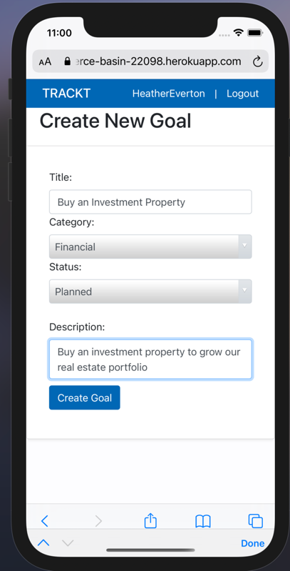
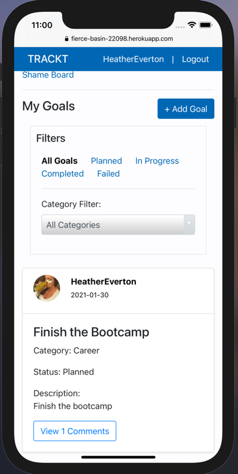
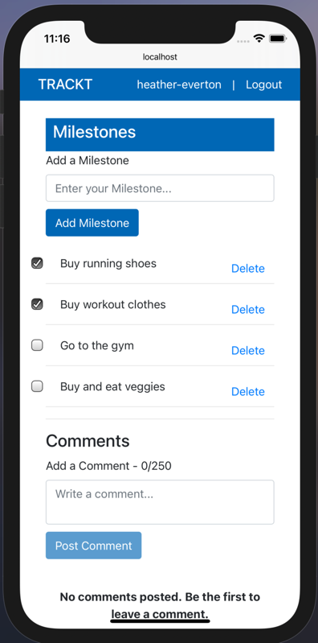
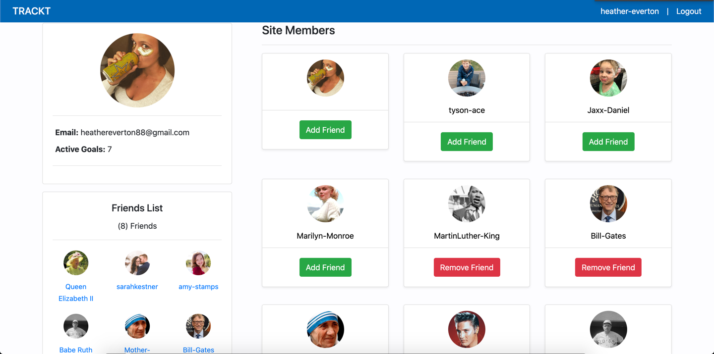
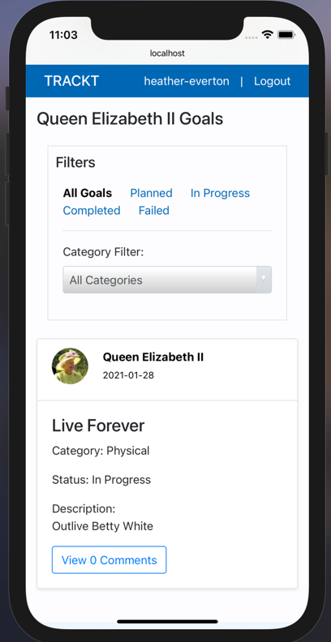
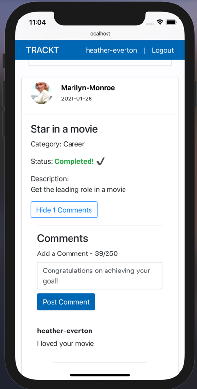
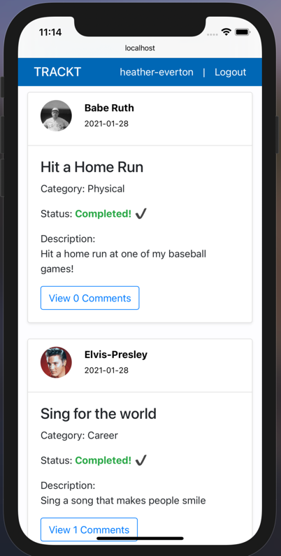
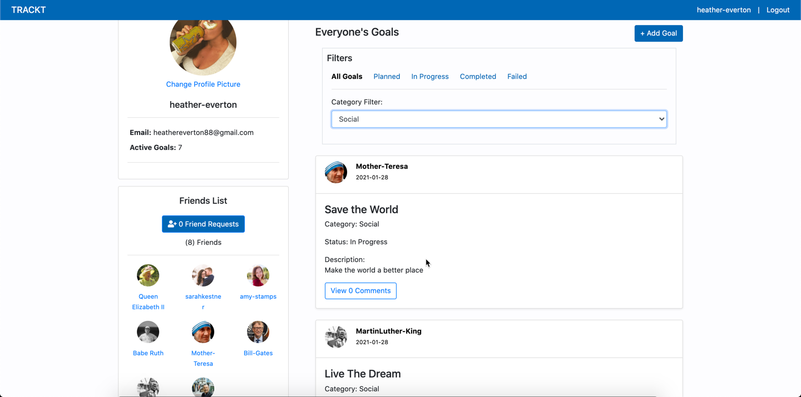
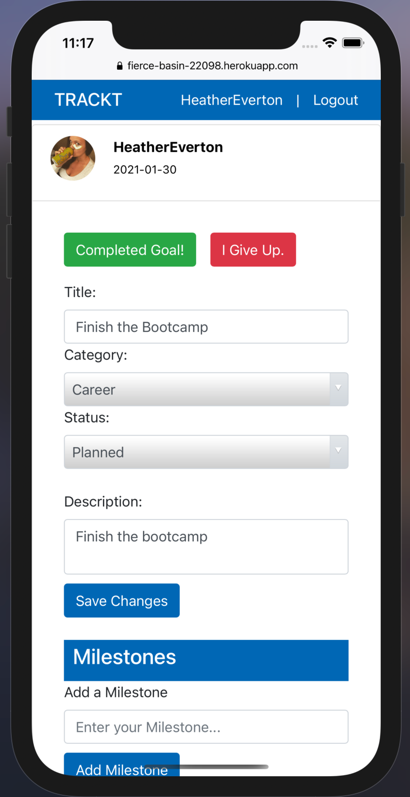
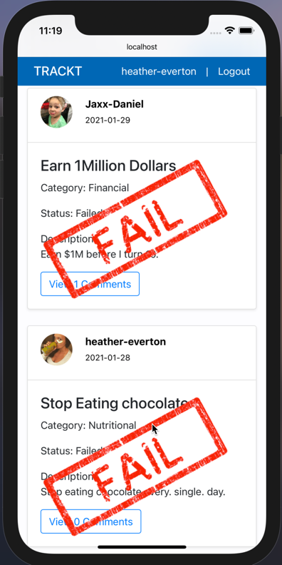

# TRACKT

Trackt is the best Goal Tracking app for everything you need to achieve life’s goals.
Get in shape, get out of debt, or get another degree. Whatever your goals Trackt will keep you focused and motivated. 

## Table of contents

- [Feature Overview](#feature-overview)
  - [Set Goals](#set-goals)
  - [Plan Milestones](#plan-milestones)
  - [Encourage Friends](#encourage-friends)
  - [Get Inspired](#get-inspired)
  - [Never Give Up](#never-give-up)
- [Technologies](#technologies)
- [Setup](#setup)
  - [Installation](#installation)
  - [Initial Login](#initial-login)
- [Inspiration](#inspiration)
- [Deployed Application](#deployed-application)
- [Contact](#contact)

## Feature Overview

- Capture your most important life goals with a simple entry form.
- Organize and manage your goals using our goal milestones to keep you moving forward.
- Boost your motivation at home, or on the go with our social media app to see your friends cheering you on.
- Gain support, recommendations, and valuable connections from our community of goal setters and achievers.
- Get Inspired to Achieve MORE while you encourage your friends in their pursuits.
- <a href="https://drive.google.com/file/d/1ajnWOlqbuERJcHII_iXKAnSL6rxoCCJ6/view?usp=sharing" target="_blank"><strong>View Demo»</strong></a>

### Set Goals

- Trackt provides you with a simple place to capture your goals, you can categorize them, track your status of each goal and enter a description to remind you why this goal is important when it get challenging. 
- Trackt also provide a space to view all of the goals you've set and comments and encouragement from your friends to help you stay motivated. 

  
  

### Plan Milestones

- Every goal needs a solid plan. You can plan out specific milestones along the way to achiving your goal to help you see progress and know what your next step is toward success. 
- Check off milestones as you work toward each goal. Each time you complete a miilestone you'll feel more and more empowered to achive the goals you've set

    

### Encourage Friends

- Connect with friends online and see the goals they've set. 
- Comment on their goals to engourage them to achive more.
  
  
  

### Get Inspired

- View the goal board to see goals others have set
- Filter the goal board to see specific interests you may have and find friends with similar interests and goals.

  
  

### Never Give Up

- Each goal you set you'll be able to Complete the goal and celebrate with your firends or Give Up. But be careful every time you give up on one of your goals it will end up on the shame board! 

  
  

## Technologies

- mongoDB
- mongoose
- nodeJS
- express
- GraphQL
- React
- Cloudinary

## Setup

### Installation

- Run 'npm install' from the command line to install required packages
- Run 'npm seed' from the command line to seed the database with test data.
- Run 'npm start' from the command line to fire up the app

### Initial Login

Sign up for the an account with a username, email address and password. You'll be able to login each time by entering your email address and password. Your username will be the name shared with your friends on the app. 

## Inspiration

We love setting and achieving goals. So many tools and trainings and blogs teach you how to SET good goals but there's never as much focus on how to actually achive the goals you set. We wanted to focus on achiving goals not just setting them. We know that a key component to being successful at the goals you set is having a support system so we created a community for motivated individuals to achieve more. By committing to your goals in a social platform and knowing your friends can see your goals you'll be more committed to achiving them. 

## Deployed Application

Deployed Application: [Trackt](https://fierce-basin-22098.herokuapp.com/login)

## Contact

Created by [Brad Cassity](https://github.com/BradCassityDev), [Heather Everton](https://github.com/heather-everton), [Christian Dehek](https://github.com/cdehek), [Evan Allen](https://github.com/ERAllen94)
